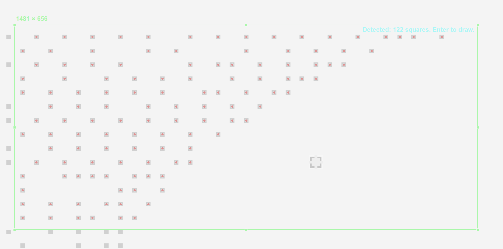

# Wplace.live Auto-Click Screenshot Tool



A powerful screenshot script with intelligent wplace.live square detection and automatic clicking capabilities.

## Features

- 📸 **Interactive Screenshot Capture** - Capture screenshots using `Ctrl+Shift+Q` hotkey
- 🔍 **Square Detection** - Automatically detect square points in captured images using OpenCV
- 🖱️ **Auto-Click** - Automatically click detected squares with configurable delay
- 🎯 **Real-time Detection** - Detection logic runs concurrently with screenshot selection
- 🛡️ **Safety Features** - Mouse movement interruption to prevent unwanted clicks
- 🎨 **Visualization** - Generate annotated images showing detected squares


## Usage

### Basic Screenshot Capture

```bash
python main.py
```

### With Square Detection

```bash
python main.py --detect-squares
```

### Custom Click Delay

```bash
python main.py --detect-squares --click-delay 0.5
```

### Hotkeys

- **F2** - Start screenshot capture
- **ESC** - Cancel screenshot or interrupt clicking sequence
- **Mouse Movement** - Interrupt automatic clicking

## Project Structure

```
wplace_opencv_autoclick/
├── main.py                  # Main application entry point
├── screenshot_capture.py    # Screenshot capture logic
├── square_detector.py       # Square detection using OpenCV
├── hotkey_listener.py       # Keyboard hotkey handling
├── debug_detection.py       # Debug utilities
├── tests/                   # Unit tests
└── assets/                  # Demo images and resources
```

## How It Works

1. **Screenshot Capture**: Press `F2` to start interactive screenshot selection
2. **Square Detection**: The application analyzes the captured region for square patterns
3. **Coordinate Calculation**: Detected squares are mapped to absolute screen coordinates
4. **Auto-Click**: The mouse automatically clicks each detected square with a configurable delay
5. **Visualization**: Results are saved with visual annotations


## Development

### Running Tests

```bash
pytest tests/
```

### Debug Mode

The application includes debug utilities in `debug_detection.py` for troubleshooting detection issues.

## Requirements

- Python 3.x
- OpenCV
- Pillow
- pynput
- numpy

## License

MIT
